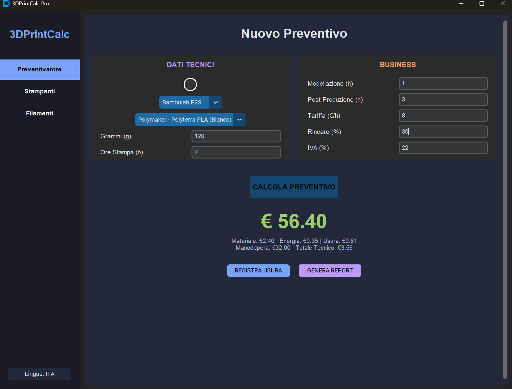
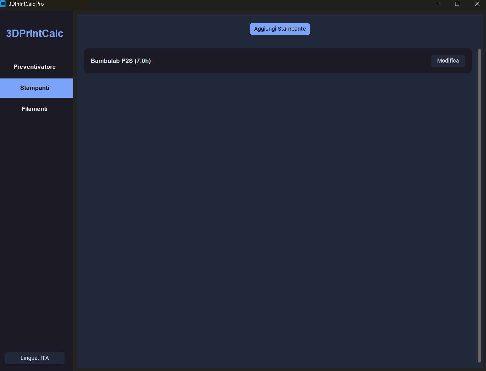
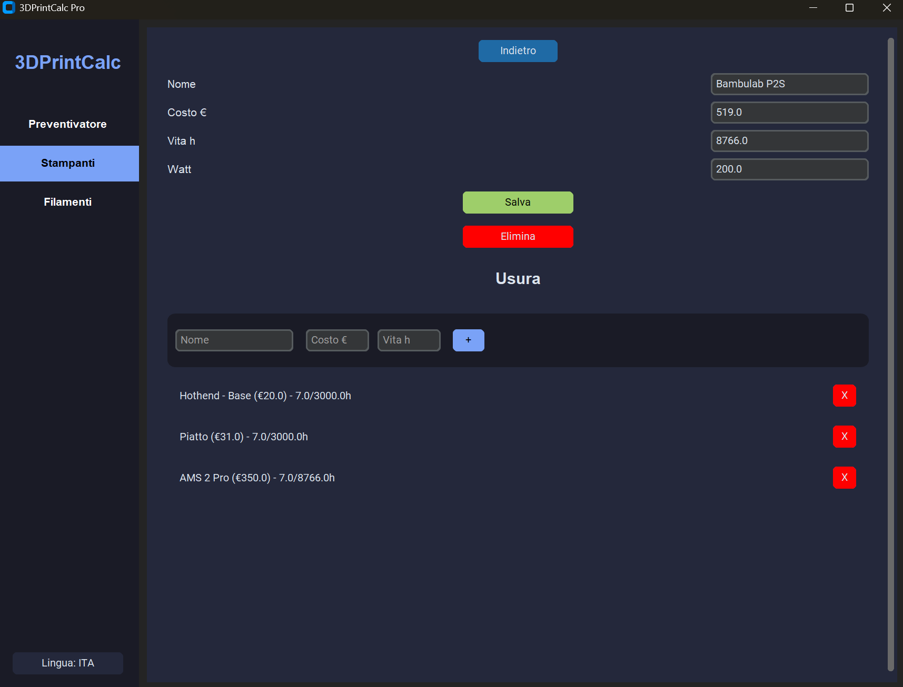
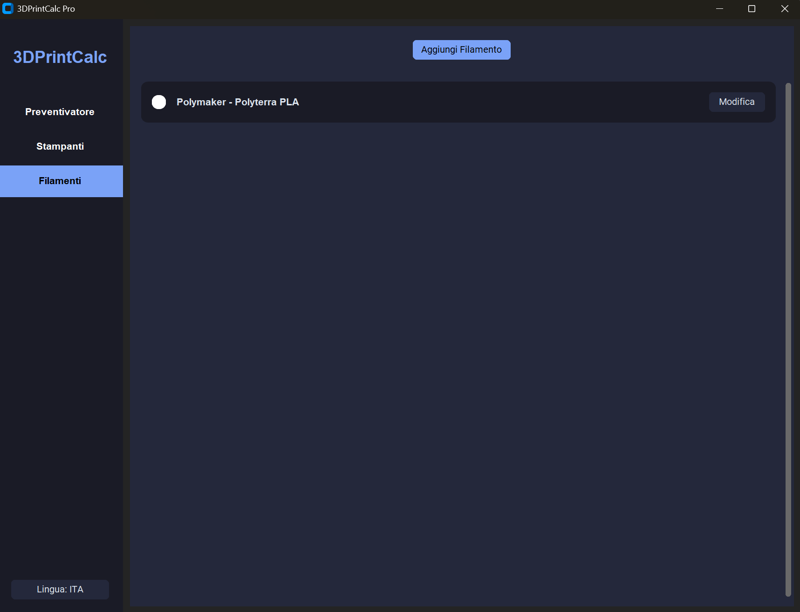
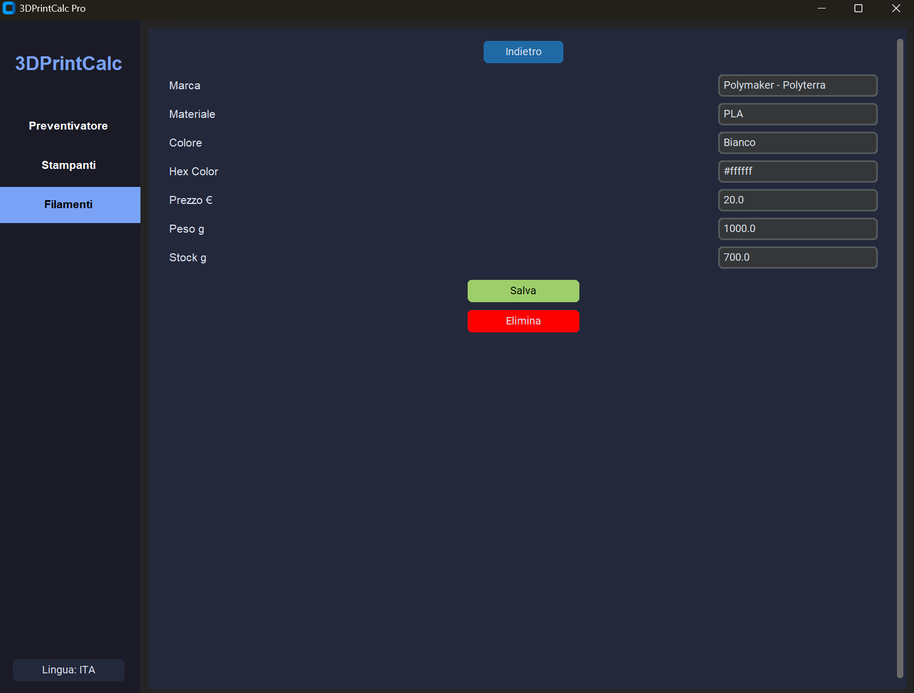

# 3DPrintCalc Pro v2.0 💎

Versione avanzata del calcolatore per stampa 3D. Disponibile sia come software desktop che come WebApp.

## 🚀 Novità v2.0 (Elite Edition)
- **Dettaglio Costi:** Visualizzazione separata di Materiale, Energia, Usura (Struttura + Pezzi) e Consumabili.
- **Workflow Inline:** Aggiunta di fasi di modellazione, post-produzione e consumabili senza finestre popup.
- **Web App Version:** Ora puoi usarlo direttamente dal browser, con salvataggio dati locale.
- **Report Avanzato:** Generazione di preventivi professionali in .txt.
- **Multi-lingua:** Supporto ITA/ENG dinamico.

## 💻 Versione Desktop (Python)
Richiede: `pip install customtkinter Pillow`
Avvio: `python 3DPrintCalc.py`

## 🌐 Versione Web
Accedi alla WebApp qui: [INSERISCI IL TUO LINK QUI]

## 📸 Screenshots
<p align="center">
  
  
  
  
  
</p>

## solo per la avviarlo con il codice sorgente, altrimenti scaricate l'eseguibile.
## 🚀 Installazione
1. Clona il repository:
   ```bash
   git clone https://github.com/SilentLuxRay/3DPrint-Calc.git 
   ```

## Installa le dipendenze:
```bash
pip install -r requirements.txt
```
## Avvia l'applicazione:
```bash
python 3DPrintCalc.py
```
### Cronologia Versioni
## v1 ✨ Caratteristiche
- **Calcolo Tecnico Preciso:** Include filamento, energia elettrica e usura dettagliata (struttura + componenti).
- **Business Ready:** Gestione Modellazione, Post-Produzione, Rincaro (%) e IVA (%).
- **Magazzino Filamenti:** Tracciamento dei grammi residui con anteprima colore HEX.
- **Manutenzione Stampante:** Monitoraggio ore di utilizzo per ogni singolo componente.
- **Multi-lingua:** Supporto completo Italiano e Inglese via JSON.
- **Report Professionale:** Generazione automatica di preventivi in formato `.txt`.